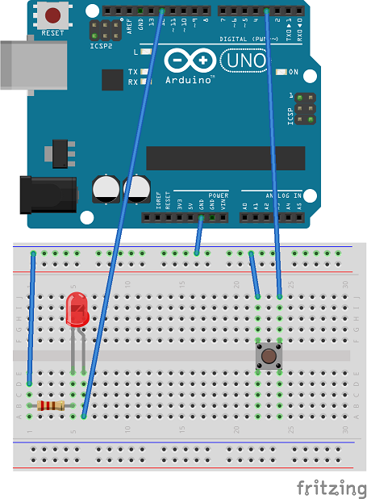

## Microsoft Remote Wiring

### Remote Device / GPIO

Finally! The Remote Device layer uses the Firmata protocol layer over the Serial stream transport layer to
finally deliver to us an AVR-C like experience in our UWP.

Similarly to how we set the pinMode and did digitalRead and digitalWrite in AVR-C we can now do this 
right inside our Windows (OR Windows Phone) apps.

Oh, GPIO stands for General Purpose Input/Output in case you were wondering.

_**DEMO 6: Light-up that LED!**_

We'll finish our application by lighting up the same LED we did about an hour ago ... again.

1. Continue your solution or open a [Starter solution](https://github.com/JAgostoni/pgh-dot-net-remote-wiring/tree/master/Demo6/Starter/)
2. Open our friend MainPage.xaml.cs
3. Create a new private member var/prop to hold our RemoteDevice instance
4. Create the instance of this object just above the .begin() method off the UsbSerial object
 - Be sure to pass in the serial object to the constructor of the RemoteDevice so it knows how to communicate
 - Internally, the RemoteDevice object will be sure to instantiate the Firmata layer
5. Handle the DeviceReady event, toss a Debug.WriteLine in there
6. In the DeviceReady event, set the pinMode of pin 12 to OUTPUT
7. In the Button_Click_2, use the digitalWrite method to light up your LED (PinState.HIGH)

Like totally exciting, right? How about a button?

1. Wire up a button like the diagram above
2. In the DeviceReady event, set the pinMode of pin 3 to PULLUP
 - Pullup mode uses an INTERNAL pullup resistor to help ensure a consistent value
3. Handle the DigitalPinUpdated event, check for pin==3 and use its state to light the LED
 - Pullup mode also, effectively, reverses the input (LOW = on/closed, HIGH = off/open)
4. Run. Light LEDs. Enjoy.

### [NEXT: Button/Band IoT Project >>](buttonbandiot.md)

[TOP](README.md)
