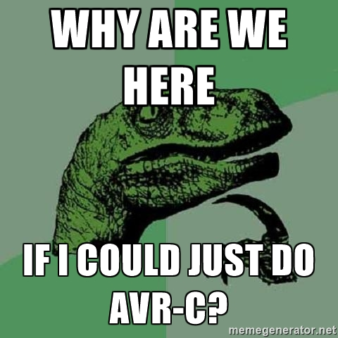

## Wrap-Up

### Why Remote Wiring?

So after all this ... why would you not just write AVR-C?

**Good reasons for Remote Wiring:**

- C# is nice
- The vast library of framework and 3rd part libraries
- Running on more capable hardware
- Can be untethered (Bluetooth)

### Why NOT Remote Wiring?

If you don't _need_ an extra component then you shouldn't add it.  Learn AVR-C, it's pretty easy.

**Reasons NOT to use Remote Wiring:**

- You don't need to communicate much with the outside world
- You don't need unlimited (cloud) computing power
- You need raw speed (serial communications introduce latency)

### Alternatives and further investigation

Some items to look into:

- Like JavaScript? Try [Johnny-Five](http://johnny-five.io/).
  - Similar base concept to Remote Wiring
  - It's where I got started!
- Alternative IDEs (Arduino IDE ... not so good)
  - List here: http://playground.arduino.cc/Main/DevelopmentTools
  - [Visual Micro](http://www.visualmicro.com/) is a plugin for Visual Studio
  - [Platform IO](http://platformio.org/platformio-ide) is available standalone or as a plugin for everything (even VIM)!

[TOP](README.md)